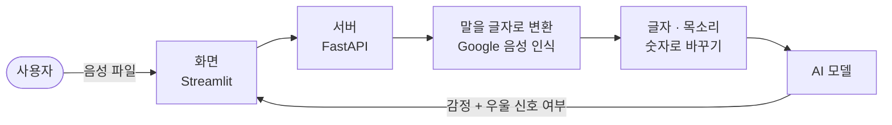
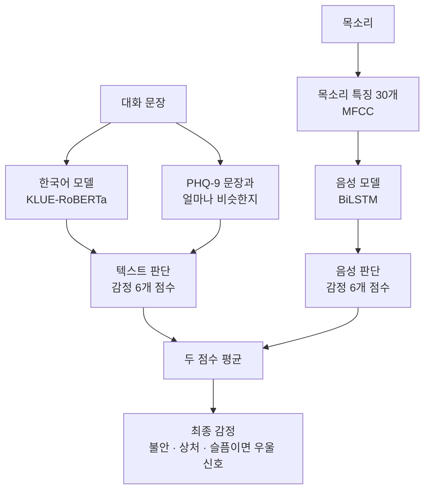
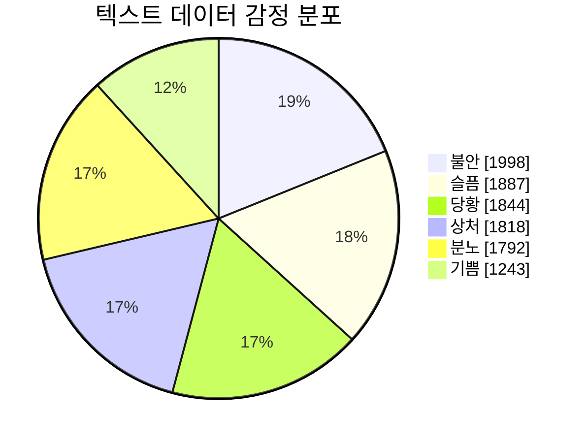
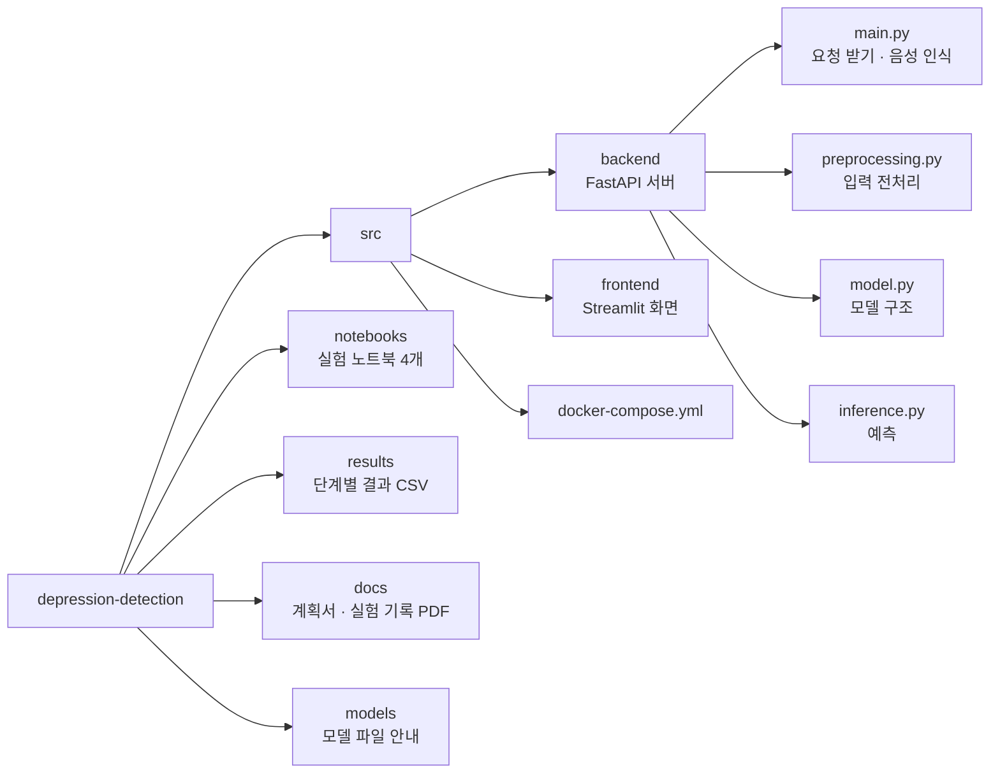

# 청소년 우울 신호 탐지

<p align="center">
  
  
  
  
  
  
</p>

녹음한 목소리를 올리면 말한 내용과 목소리를 함께 보고 우울 신호가 있는지 알려준다.

"짜증 나", "화나" 같은 흔한 부정 감정과 불안·상처·슬픔처럼 더 신경 써야 하는 감정을 나눠 보고 싶어서 시작했다. 그래서 맞힌 비율보다 우울 신호를 놓치지 않는 쪽을 더 중요하게 봤다.

| | |
|---|---|
| 기간 | 2025.10 ~ 2025.11 |
| 실험 | 3단계, 모델 14개 비교 |
| 배포 | Docker로 묶어 AWS EC2에 올렸다 (지금은 서버를 내린 상태) |

## 동작 흐름



화면과 서버는 각각 Docker로 묶여 있고 `docker compose` 한 번으로 같이 뜬다.

## 모델 구조



- 한국어 모델은 12개 층 중 마지막 3개 층만 이 데이터로 더 학습시켰다.
- PHQ-9는 병원에서 쓰는 우울증 자가 검사지다. 여기서 "죽고 싶다", "잠들기 어렵다" 같은 문장 25개를 뽑고 입력 문장이 그중 가장 비슷한 것과 얼마나 닮았는지를 점수 하나로 만들어 같이 넣었다.
- MFCC는 목소리의 음색을 숫자 30개로 요약한 것이다.

## 우울 신호 기준

AI Hub 감성 대화 데이터의 감정 6개 중 3개를 우울 신호로 묶었다.

| 구분 | 감정 | 세부 감정 예시 |
|---|---|---|
| 일반 | 기쁨 · 당황 · 분노 | 편안한, 부끄러운, 짜증 나는 |
| 우울 신호 | 불안 · 상처 · 슬픔 | 걱정스러운, 버려진, 좌절한 |

## 데이터

- 텍스트: AI Hub 감성 대화 말뭉치에서 청소년 대화만 골라 10,582건. 대화 하나에 사람이 한 말 3문장이 들어 있다.
- 음성: AI Hub 음성 데이터 2,876건. 감정 이름은 위 6개에 맞게 바꿔 썼다(행복 → 기쁨 등).
- 학습 70%, 테스트 30%로 나눴고 랜덤 시드는 42로 고정했다.



## 실험


단계마다 한 가지만 바꿔서 비교했다. 표에 나오는 숫자는 이렇게 읽으면 된다.

- 정확도: 감정 6개 중 정답을 맞힌 비율
- 탐지율: 실제 우울 신호 중 모델이 잡아낸 비율. 낮으면 도움이 필요한 사람을 놓친다.

### 1단계. 어떻게 학습시킬까

탐지율 기준으로 비교했고 굵은 쪽을 골랐다.

| 비교 | A | B |
|---|---|---|
| 감정 분류 | **6개 그대로 82.3%** | 4개(긍정·중립·일반 부정·우울)로 다시 묶기 73.6% |
| 문장 범위 | **대화 3문장 전체 82.3%** | 첫 문장만 81.1% |
| 학습 방식 | **한국어 모델까지 학습 82.3%** | 단어 뜻만 평균 내서 분류 48.5% |

짜증과 좌절처럼 비슷해 보이는 감정을 합치지 않고 따로 두는 편이 나았다. 학습 방식에서 차이가 가장 크게 났다.

### 2단계. PHQ-9 점수 넣기

| | 정확도 | 탐지율 | 놓친 우울 신호 |
|---|---|---|---|
| PHQ-9 없음 | 69.1% | 82.3% | 303건 |
| **PHQ-9 점수 추가** | 69.2% | **83.5%** | **283건** |

숫자 하나를 더 넣었을 뿐인데 놓친 건수가 20건 줄었다. 처음엔 자살·자해 표현에 3배 점수를 주는 식으로 키워드를 세는 방법도 만들었는데, 비슷한 정도만 쓴 쪽이 결과가 더 좋아서 뺐다. 4개 분류 모델에서는 오히려 탐지율이 떨어졌다(73.6% → 70.4%).

### 3단계. 목소리 추가

음성이 있는 2,876건으로 따로 실험했기 때문에 1·2단계 숫자와 바로 비교하면 안 된다.

| | 정확도 | 탐지율 | 정밀도 | 놓친 우울 신호 |
|---|---|---|---|---|
| **텍스트만** | **71.1%** | **90.2%** | 94.6% | 63건 |
| 텍스트 + 목소리 | 64.7% | 82.7% | **97.4%** | 111건 |

정밀도는 모델이 우울 신호라고 한 것 중 실제로 맞은 비율이다.

목소리를 넣었더니 성능이 떨어졌다. 이유는 이렇게 봤다.

1. 음성 모델이 텍스트 모델보다 훨씬 약한데, 두 점수를 반반 평균 내면서 텍스트 쪽 판단까지 흐려졌다.
2. 음성 데이터가 연기해서 녹음한 것이라 실제로 우울한 사람의 말투가 잘 담겨 있지 않다.
3. 무료 Colab GPU로는 큰 음성 모델(Wav2Vec 2.0 등)을 돌릴 수 없었다.

그래도 배포는 텍스트 + 목소리 모델로 했다. 말투나 톤 같은 목소리 정보를 계속 쓰고 싶었고 음성 쪽만 개선하면 올라갈 여지가 크다고 봤다.

## 폴더 구조



## 실행

```bash
git clone https://github.com/TaehyukRyu/depression-detection.git
cd depression-detection/src
docker compose up --build
```

- 모델 파일(`phase3_six_label_all_text_phq9_multimodal.pt`, 약 450MB)은 용량 때문에 저장소에 올리지 않았다. 필요하면 메일로 요청하면 된다. 받은 파일은 `src/backend/models/` 안에 넣는다.
- 실행하면 화면은 http://localhost:8501, 서버는 http://localhost:8000 에서 열린다.
- 음성 파일은 WAV나 FLAC으로 올려야 한다. 글자 변환에 Google 음성 인식을 써서 인터넷 연결도 필요하다.

<details>
<summary>Docker 없이 실행</summary>

```bash
# 서버
cd src/backend
pip install -r requirements.txt
uvicorn main:app --port 8000

# 화면 (새 터미널)
cd src/frontend
pip install -r requirements.txt
streamlit run app.py
```

</details>

## 한계

- 음성 모델이 약해서 합치면 오히려 성능이 떨어진다. 음성용으로 미리 학습된 모델(Wav2Vec 2.0, HuBERT)로 바꿔볼 생각이다.
- 지금은 마지막에 점수만 평균 낸다. 텍스트와 음성을 더 앞 단계에서 섞는 방식도 해볼 만하다.
- 음성 데이터가 연기 녹음이라 실제 상담 상황과는 거리가 있다.
- 청소년 대화로만 학습해서 다른 나이대에 쓰려면 다시 학습해야 한다.

이 서비스는 진단 도구가 아니다. 결과는 참고용으로만 보고 힘든 상태가 이어지면 전문가와 상담하길 권한다.

## 문의

xogur1578@gmail.com
